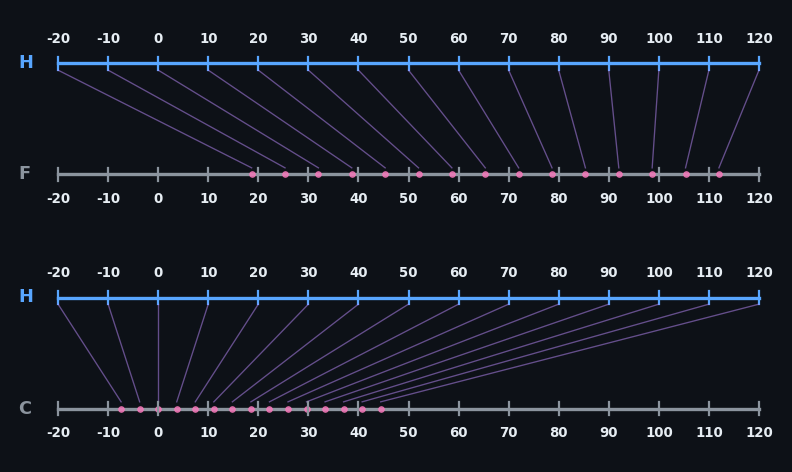
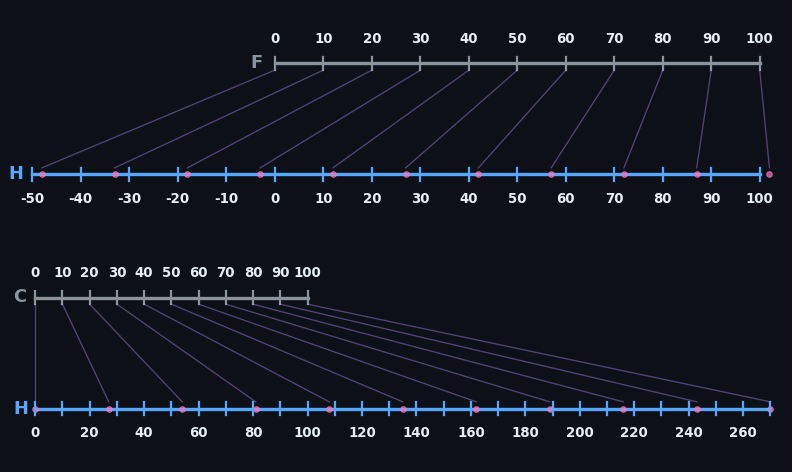

# The Herron Temperature Scale

The Herron (H) temperature scale is a practical temperature system with two intuitive reference points:

- **0 H** = Freezing point of water (32°F / 0°C)
- **100 H** = Human body temperature (98.7°F / 37°C)

Very simple and straightforward, and it wasn't exactly a lot of work to create. However, as far as I can tell no one has ever proposed this system before (at least, I can't find it anywhere). So then, this document is my proposal. I do think it's superior for everyday use, and if nothing else it's an interesting alternative. 

I'm calling this the Herron scale only because every major temperature system seems to have taken the surname of its inventor. If you have a better name idea, I'm open to anything that would increase the likelihood of adoption.

PS: Nothing will increase the likelihood of adoption.

I'm surprised you're even reading this.

## Conversion Formulas

### Fahrenheit ⟷ Herron
- **F to H:** H = 3/2 × (F - 32)
- **H to F:** F = (2/3 × H) + 32

### Celsius ⟷ Herron
- **C to H:** H = 27/10 × C
- **H to C:** C = 10/27 × H

## Degree Intervals

- **1°H = 0.667°F** (or 2/3°F)
- **1°F = 1.5°H** (or 3/2°H)
- **1°H = 0.370°C** (or 10/27°C)
- **1°C = 2.7°H** (or 27/10°H)

## Common Temperature Examples

|                     | °H  |
|---------------------|-----|
| Home freezer        | -48 |
| Freezing water      | 0   |
| Refrigerator        | 12  |
| Cool day            | 30  |
| Average Earth temp  | 40  |
| Room temperature    | 55  |
| Perfect day         | 60  |
| Nice weather        | 65  |
| Pool water          | 72  |
| Hot day             | 90  |
| Body temperature    | 100 |
| Fever               | 105 |
| Hair dryer          | 160 |
| Hot coffee          | 200 |
| Green tea (brewing) | 215 |
| Boiling water       | 270 |
| Baking cookies      | 475 |
| Baking bread        | 515 |
| Pizza oven          | 650 |
| Broiling            | 700 |

**Key temperature scale relations**

|                                       | Herron   | Kelvin   | Celsius    | Fahrenheit |
|---------------------------------------|----------|----------|------------|------------|
| Absolute zero                         | -737.5 H | 0 K      | −273.15 °C | −459.67 °F |
| Boiling point of liquid nitrogen      | -529.7 H | 77.4 K   | −195.8 °C  | −320.4 °F  |
| Sublimation point of dry ice          | -210.6 H | 195.1 K  | −78 °C     | −108.4 °F  |
| Melting point of ice                  | 0 H      | 273.15 K | 0 °C       | 32 °F      |
| Common room temperature               | 54 H     | 293 K    | 20 °C      | 68 °F      |
| Herron and Fahrenheit intersection    | 96 H     | 308.71 K | 35.56 °C   | 96 °F      |
| Average normal human body temperature | 100 H    | 310.15 K | 37.0 °C    | 98.6 °F    |
| Boiling point of water                | 270 H    | 373.13 K | 100 °C     | 212 °F     |

## Common indoor temperature range

| °F | °H |
|----|----|
| 60 | 42 |
| 62 | 45 |
| 64 | 48 |
| 66 | 51 |
| 68 | 54 |
| 70 | 57 |
| 72 | 60 |
| 74 | 63 |
| 76 | 66 |
| 78 | 69 |
| 80 | 72 |

With each degree being more precise, you might think about ambient/weather temperature in 5°H increments:

| °H  | °F   | °C   |
|-----|------|------|
| 20  | 45.3 | 7.4  |
| 25  | 48.7 | 9.3  |
| 30  | 52.0 | 11.1 |
| 35  | 55.3 | 13.0 |
| 40  | 58.7 | 14.8 |
| 45  | 62.0 | 16.7 |
| 50  | 65.3 | 18.5 |
| 55  | 68.7 | 20.4 |
| 60  | 72.0 | 22.2 |
| 65  | 75.3 | 24.1 |
| 70  | 78.7 | 25.9 |
| 75  | 82.0 | 27.8 |
| 80  | 85.3 | 29.6 |
| 85  | 88.7 | 31.5 |
| 90  | 92.0 | 33.3 |
| 95  | 95.3 | 35.2 |
| 100 | 98.7 | 37.0 |

## Conversion Table

| °H  | °F    | °C    |
|-----|-------|-------|
| -50 | -1.3  | -18.5 |
| -40 | 5.3   | -14.8 |
| -30 | 12    | -11.1 |
| -20 | 18.7  | -7.4  |
| -10 | 25.3  | -3.7  |
| 0   | 32    | 0     |
| 10  | 38.7  | 3.7   |
| 20  | 45.3  | 7.4   |
| 30  | 52    | 11.1  |
| 40  | 58.7  | 14.8  |
| 50  | 65.3  | 18.5  |
| 60  | 72    | 22.2  |
| 70  | 78.7  | 25.9  |
| 80  | 85.3  | 29.6  |
| 90  | 92    | 33.3  |
| 100 | 98.7  | 37    |
| 110 | 105.3 | 40.7  |
| 120 | 112   | 44.4  |
| 130 | 118.7 | 48.1  |
| 140 | 125.3 | 51.9  |
| 150 | 132   | 55.6  |
